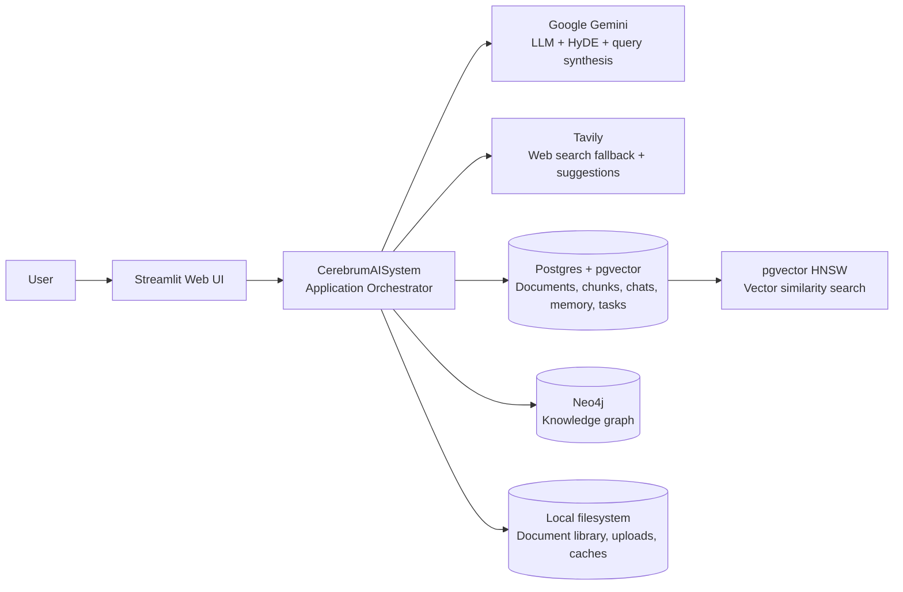
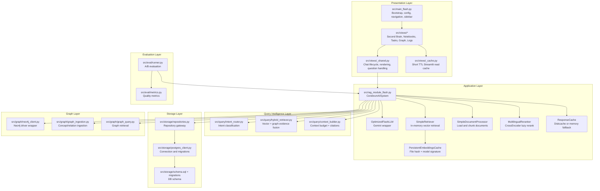
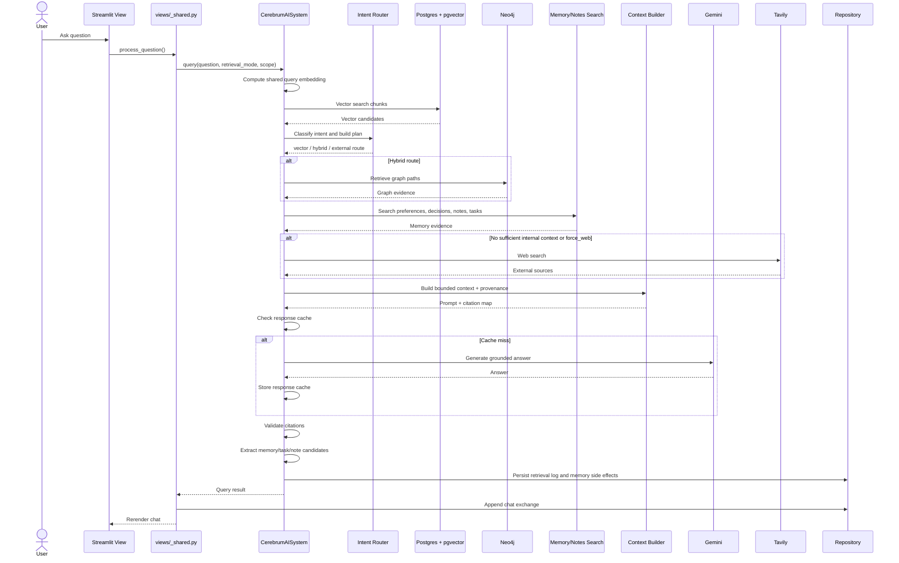
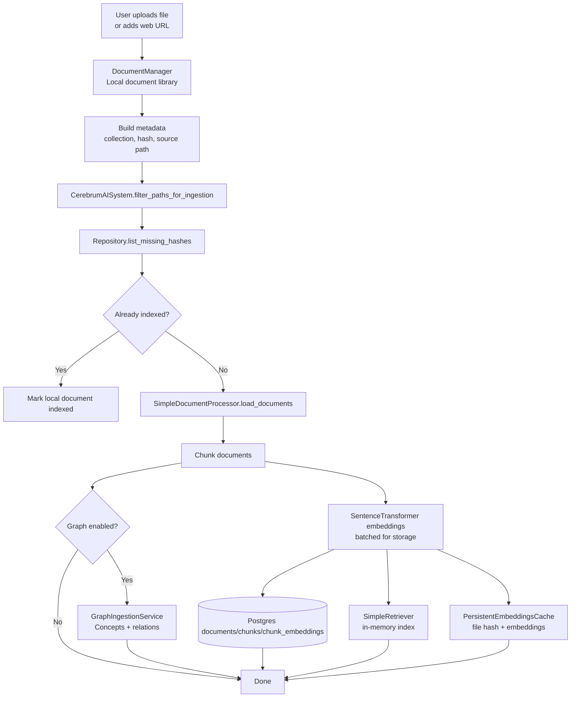
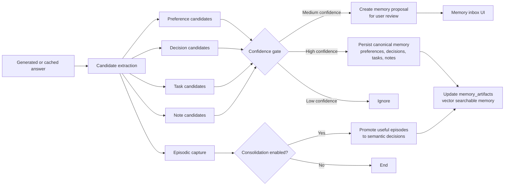
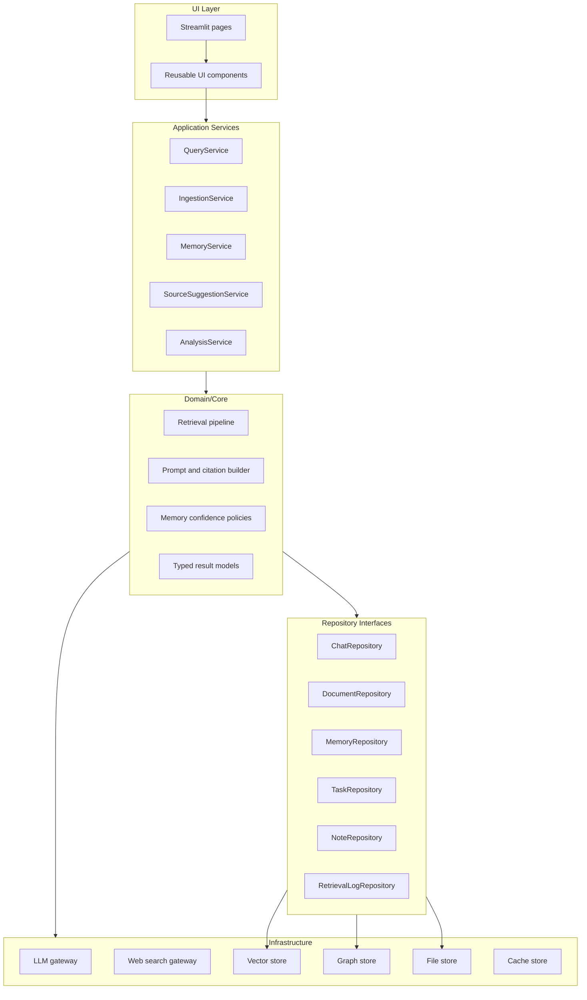

# ResearchAIBuddy Architecture Design

This document captures the current architecture as an editable set of Mermaid
diagrams. It reflects the codebase shape as a modular Streamlit monolith with
external storage and AI integrations.

## 1. System Context

## 2. Container View

## 3. Query Data Flow

## 4. Document Ingestion Flow

## 5. Memory And Side Effects Flow

## 6. Recommended Target Architecture

## 7. Key Design Notes

- Keep Streamlit views thin: render UI, collect input, call application services.
- Split `CerebrumAISystem` into focused services before adding more features.
- Keep retrieval, memory capture, answer generation, and persistence as separate
  pipeline stages.
- Use typed DTOs for query results and evidence instead of large unstructured
  dictionaries.
- Lazy-load heavy ML libraries so tests and UI boot do not import the whole ML
  stack unless retrieval actually needs it.
- Treat Postgres as the source of truth; keep local JSON/document library as an
  ingestion cache and fallback only.
