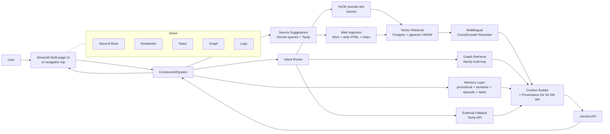

# Arhitectura Software - CerebrumAI "Second Brain"

## 1. Scop
CerebrumAI este un asistent personal bazat pe documente proprii (PDF/TXT/MD) si surse web capturate, organizate pe topicuri (notebooks) + colectia generala, care raspunde grounded (cu provenienta) si mentine memorie personala. Suporta intrebari cross-lingual (RO ↔ EN) si fallback la web search cand sursele interne sunt insuficiente.

## 2. Stil arhitectural
- Modular monolith, stratificat
- UI: Streamlit multi-page via `st.navigation(position="top")`
- Core orchestration: `CerebrumAISystem`
- Storage hibrid:
  - Postgres + pgvector / HNSW (documente, chat, memorii, task-uri, vector search)
  - Neo4j (relatii Concept/Decision pentru interogari relationale)
- LLM: Gemini 2.5 Flash (raspuns + HyDE + extragere queries pentru sugestii surse)
- Web search: Tavily API (fallback + sugestii proactive)
- Embeddings: `paraphrase-multilingual-MiniLM-L12-v2` (384-dim, multilingv)
- Reranker: `cross-encoder/mmarco-mMiniLMv2-L12-H384-v1` (multilingv, lazy load)

## 3. Componente principale

### 3.1 Presentation Layer
- `src/main_flash.py` — bootstrap, sidebar, top nav nativ via `st.navigation`
- `src/views/*` — un view per pagina:
  - `second_brain.py` — chat global peste tot corpusul; tabs interne **Conversație** / **Insights & Tools**
  - `notebooks.py` — spatii de lucru per topic; 2 coloane (Surse + Chat) + mini graf
  - `tasks.py` — kanban (Open/In Progress/Done) + reminders + quick capture
  - `graph.py` — vizualizare interactiva a knowledge graph (Plotly, force-directed)
  - `retrieval_logs.py` — statistici latenta + log queries
- Helpers partajati: `views/_shared.py` (chat session lifecycle, render chat history, `navigate_to`), `views/_documents.py` (sync, reindex, fetch web URL), `views/_suggestions.py` (panou de sugestii surse)
- Responsabilitati:
  - upload documente si fetch surse web Tavily
  - management chat / topic / query mode / chat history per scope
  - afisare surse / provenienta / memory hits / contradictii / drift / digest
  - status runtime (DB, sync, Tavily, reindex banner)

### 3.2 Application Layer
- `src/rag_module_flash.py`
- Clasa principala: `CerebrumAISystem`
- Componente interne:
  - `OptimizedFlashLLM` — wrapper Gemini cu retry
  - `GeminiRateLimiter` — limite RPM/RPD
  - `PersistentEmbeddingsCache` — cache cu `model_signature.json` (auto-invalidare la schimbare model)
  - `MultilingualReranker` — CrossEncoder lazy-loaded (rerancher top-20 → top-N)
  - `SimpleRetriever` — vector search + neighbor expansion
  - `SimpleDocumentProcessor` — chunking
- Responsabilitati:
  - ingestie documente (din upload local sau URL web)
  - orchestrare retrieval (vector / hybrid / web)
  - HyDE pseudo-document expansion la calculul query embedding
  - rerank multilingv pe candidatii vector
  - construire context pentru LLM
  - fallback extern (Tavily) cand context intern e insuficient
  - extractie/persistenta memorii (procedurala, semantica, episodica, task)
  - sugestii proactive de surse (`suggest_sources` + `_build_suggestion_queries`)

### 3.3 Query Intelligence Layer
- `src/query/intent_router.py`
- `src/query/hybrid_retriever.py`
- `src/query/context_builder.py`
- Responsabilitati:
  - clasificare intent (`factual`, `relational`, `temporal`, `reminder`)
  - rutare `vector` vs `hybrid` vs `external` (web)
  - fuziune dovezi vector + graph + memorie
  - aplicare context budget (vector ratio + graph ratio configurabile) si citari `[D#]`, `[G#]`, `[M#]`

### 3.4 Storage Layer (DB-first)
- `src/storage/postgres_client.py`
- `src/storage/repositories.py`
- `src/storage/schema.sql`
- Responsabilitati:
  - sursa principala pentru chat-uri, documente, memorii, task-uri
  - deduplicare documente prin `file_hash`
  - vector search in pgvector (index HNSW)
  - logging retrieval pentru evaluare
  - CRUD complet decisions / preferences / tasks (folosit de Editor Memorie)
  - weekly summary aggregations
  - dismiss/restore pentru contradictii (Neo4j-side)

### 3.5 Graph Layer
- `src/graph/neo4j_client.py`
- `src/graph/graph_ingestion.py`
- `src/graph/graph_query.py`
- Responsabilitati:
  - ingestie concepte/relatii din chunk-uri
  - relation confidence gating
  - interogari multi-hop pentru intrebari relationale
  - detectie contradictii (relatii `CONTRADICTS`) cu dismiss/restore reversibil
  - vizualizare graph pentru UI (Plotly force-directed)

### 3.6 Evaluation Layer
- `src/eval/metrics.py`
- `src/eval/runner.py`
- Responsabilitati:
  - comparatie A/B (baseline vs hybrid+memory)
  - metrici: groundedness, route accuracy, latenta avg/p50/p95
  - export rapoarte JSON/MD

### 3.7 External Integrations Layer
- Tavily Web Search API (`https://api.tavily.com/search`)
- Folosit in doua moduri:
  - **Reactiv (web fallback)**: `_fetch_external_sources()` apelat de `_run_external_fallback()` cand contextul intern e insuficient sau cand user-ul forteaza prin `force_web=True`
  - **Proactiv (source suggestions)**: `suggest_sources()` apelat din UI ("Genereaza sugestii") cu queries sintetizate de Gemini
- Configurare: `tavily_api_key` (env `TAVILY_API_KEY` sau `config.json`), `web_fallback_search_depth` (basic/advanced), `web_fallback_max_results`

## 4. Model de date (rezumat)

### 4.1 Postgres
- `collections`
- `documents`
- `chunks`
- `chunk_embeddings` (pgvector, HNSW index, dim=384)
- `chats`
- `messages`
- `decisions` (memorie semantica)
- `preferences` (memorie procedurala)
- `tasks` (action layer)
- `retrieval_logs`

### 4.2 Neo4j
- Noduri: `Topic`, `Document`, `Chunk`, `Concept`, `Decision`
- Relatii uzuale: `ABOUT_TOPIC`, `SOURCED_FROM`, `MENTIONS`, `RELATED_TO`, `DEPENDS_ON`, `CONTRADICTS`, `DERIVED_FROM`, `DECIDED_IN`
- Proprietati relatii: `confidence`, `dismissed`, `dismissed_at`, `dismiss_note` (pentru CONTRADICTS)

### 4.3 Filesystem
- `data/uploaded_docs/` — fisiere originale (upload + `web_*.txt` din Tavily)
- `data/embeddings_cache/` — cache embeddings + `model_signature.json` (tracking model + flag `reindex_pending`)
- `data/cache/responses_cache/` — diskcache pentru LLM responses

## 5. Fluxuri principale

### 5.1 Ingestie documente

**5.1a Upload local (PDF/TXT/MD)**
1. Upload in UI (Notebook view sau sidebar)
2. Salvare in `data/uploaded_docs/`
3. Inregistrare in `documents` cu `file_hash` (deduplicare)
4. Extractie text + chunking
5. Embeddings (multilingv, batch)
6. Persistenta in Postgres (`chunks` + `chunk_embeddings`)
7. Ingestie graf (optional): concepte + relatii in Neo4j

**5.1b Ingestie sursa web Tavily**
1. URL provenit din: (a) panou "Surse sugerate" sau (b) buton "Adauga" pe o sursa externa din chat
2. `add_web_url_as_document()` face `requests.get(url, timeout=20)`
3. Strip HTML: scripts, styles, tags, entities, whitespace
4. Validate: minim 150 caractere text util
5. Save ca `web_<safe_title>.txt` in `data/uploaded_docs/` (cu header `Source: <url>`)
6. De aici intra in pipeline-ul comun cu 5.1a (chunking → embeddings → pgvector)

### 5.2 Interogare
1. Utilizatorul pune intrebare (chat input pinned bottom)
2. Intent router decide ruta (`vector` / `hybrid` / `external`)
3. Daca `force_web=True` din UI → short-circuit direct la Tavily
4. Query embedding:
   - base: `encode(question)`
   - opt HyDE: Gemini genereaza pseudo-document (1-2 propozitii); embedding mediat cu base
5. Retrieval:
   - vector din pgvector (oversample `reranker_input_k`)
   - rerank multilingv (CrossEncoder lazy-loaded) → top-K final
   - graph paths din Neo4j (daca hybrid)
6. Injectare memory hits (preferences/decisions/episodes/tasks)
7. Daca `INSUFFICIENT_CONTEXT` detectat → fallback Tavily (`_run_external_fallback`)
8. Context builder → prompt cu provenance (citari `[D#]`, `[G#]`, `[M#]`, `[W#]` pentru web)
9. Gemini genereaza raspuns
10. Persistenta mesaj + log retrieval + actualizare memorii

### 5.3 Memorie personala
- Procedurala: preferinte extrase din instructiuni user
- Semantica: decizii/concluzii persistate
- Episodica: evenimente din chat (mesaje assistant)
- Task/reminder: elemente actionabile extrase din conversatie
- Consolidare: episodic → semantic (periodic)
- Decay: reducere episodic vechi (configurabil prin `memory_decay_days`)
- CRUD: editor in Second Brain → Insights & Tools (edit confidence, sterge, restaureaza)

### 5.4 Sugestii surse (proactiv + reactiv)

**5.4a Proactiv — panou "Surse sugerate"**
1. User da click pe "Genereaza sugestii" in Second Brain sau Notebook
2. `suggest_sources(topic_collection, recent_chat_history)` aduna context:
   - ultimele 5 intrebari din chat
   - top 5 preferinte din DB
   - ultimele 3 decizii din DB
   - numele notebook-ului (daca exista scope)
3. `_build_suggestion_queries()` — Gemini sintetizeaza 2-3 queries concise in engleza
4. Tavily ruleaza fiecare query → rezultate deduplicate pe URL
5. UI afiseaza carduri cu titlu/snippet/buton "Adauga"
6. Click "Adauga" → flux 5.1b

**5.4b Reactiv — buton "Adauga" pe surse externe din chat**
1. Cand un raspuns a folosit Tavily, `external_sources` apare in chat history
2. In expander-ul "Surse externe (web)" → buton "Adauga" langa fiecare URL
3. Click → flux 5.1b
4. URL adaugat este marcat in `st.session_state.chat_added_urls` → buton devine "✓ Adaugat"

### 5.5 Lifecycle model embeddings
1. La init, `PersistentEmbeddingsCache` verifica `model_signature.json` vs config-ul curent
2. Daca modelul s-a schimbat → `reindex_pending=True` salvat in signature
3. UI afiseaza banner reindexare in top of main area
4. User da click "Reindexeaza acum" → `reindex_all_documents()`:
   - sterge `chunks` + `chunk_embeddings` (CASCADE)
   - reseteaza `documents.indexed=FALSE`
   - re-ingesta toate fisierele cu modelul nou
   - sterge `model_signature.json` flag

## 6. Caching vs memorie
- Caching tehnic (performanta):
  - cache raspunsuri LLM (diskcache)
  - cache embeddings (persistent, cu invalidare la schimbare model)
  - reranker lazy-loaded (incarcat doar la prima utilizare)
- Memorie de produs (knowledge personal):
  - preferences/decisions/episodes/tasks
- Concluzie: cache-ul optimizeaza cost/latenta, memoria optimizeaza continuitatea si personalizarea.

## 7. Rezilienta si fallback
- DB primary, fallback local pentru scenarii de avarie
- Daca contextul intern e insuficient: fallback extern Tavily, etichetat explicit (`answer_origin=external`)
- Daca `enable_web_fallback=False` si nu `force_web` → mesaj explicit "context insuficient, web fallback dezactivat"
- Daca Tavily nu e configurat (lipsa key) → web suggestions si fallback dezactivate automat, status afisat in sidebar
- Provenienta este expusa in UI pentru auditabilitate
- Reranker fail → bypass cu top-K original (graceful degradation)
- HyDE fail (Gemini eroare) → bypass cu base embedding only

## 8. Principii de design
- Grounded first: raspunsuri bazate pe dovezi (interne sau externe)
- Explainable output: route + provenance + memory hits + router_reason
- Incremental upgrade path: VectorRAG → HybridRAG → Second Brain → Multilingual + Web Grounded
- Config-first behavior: praguri si moduri controlate din `config.json`
- Reactiv si proactiv: user-ul poate cere sugestii (proactiv) sau captura din rezultat (reactiv)
- Pipeline unificat: surse web si fisiere locale partajeaza acelasi flux de chunking/indexare

## 9. Diagrama logica (high-level)

